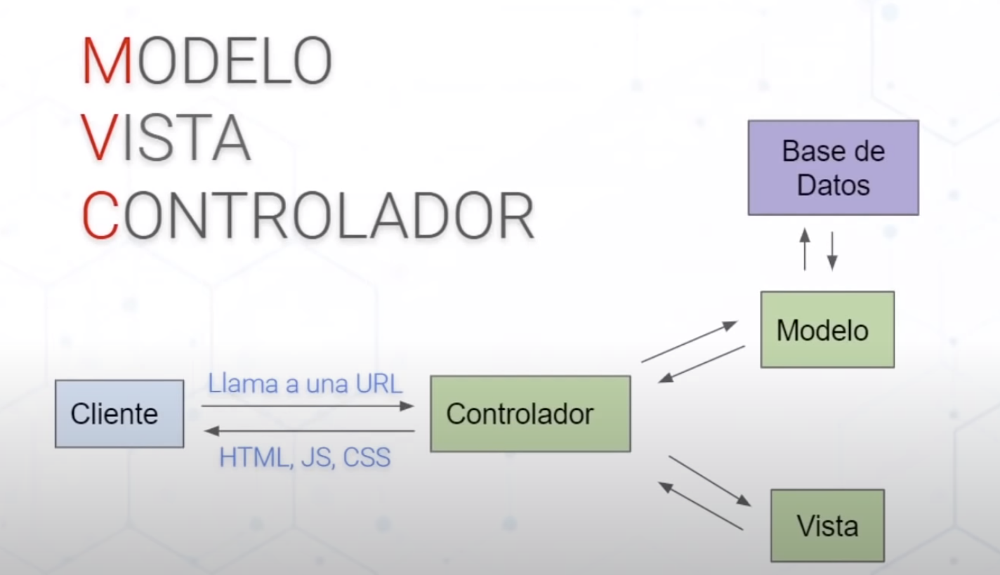
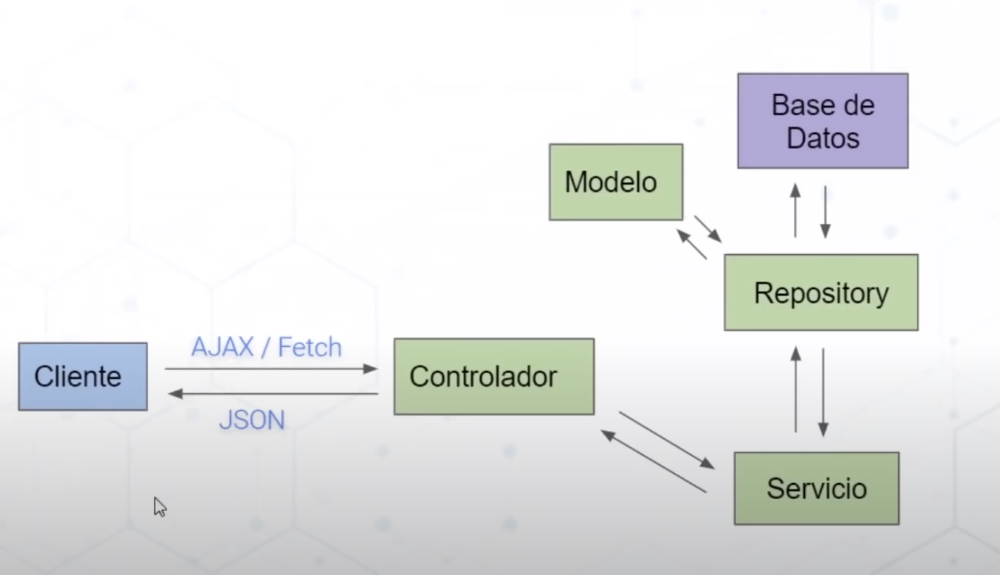

# Fullstack (springboot, hibernate, JWT, API Rest)

Curso sobre como crear un sistema de usuario completo en Java con springboot, hibernate, JWT y API Rest con arquitectura MVC. CRUD con usarios y su inicio de sesión.

## Base

Proyecto basado en: 'https://www.youtube.com/watch?v=7vHzVN0EiQc&ab_channel=ATLAcademy%28byLucasMoy%29'

## Contenido de aprenfizaje

1. Inyección de dependencias
2. Control de sesion de usuarios con estandar JWT
3. Servicios API-REST con SpringBoot 3.0.5 (springweb)
4. ORM con Hibernate
5. Inicializar proyecto con: 'https://start.spring.io/'
6. Dependencias con MAVEN (3.9.1) y Empaquetado WAR - openJDK 17.0.6
7. Front Booststrap

## Estrutura de archivos

1. POM.xml: Estructura del proyecto, definiciones y dependencias de maven
2. src: codigo
3. test: codigo para pruebas
4. main: codigo del proyecto
5. resources: archivos de configuración y archivos del front
6. resources/static: archivos de acceso publico: archivos multimedia, *.html o index.html
7. java: codigo fuente del proyecto

## Comandos Spring boot

- iniciar app web: `mvn spring-boot:run`
- limpiar proyecto para recompilar: `mvn:clean`

Aplicación: Apache Tomcat: puerto 8080

# XML vs JSON

Manera de como se hace el intercambia de información entre servicios.

| XML                                                    	| vs 	| JSON                                                    	|
|--------------------------------------------------------	|----	|---------------------------------------------------------	|
| XML: Lenguaje de marcado extensible                    	|    	| JSON: JavaScript Object Notation                        	|
| uso de Tags personalizados si se quiere                	|    	| Es mas lijero                                           	|
| Es un estandar                                         	|    	| Es un formato                                           	|
| Estructura rigida                                      	|    	| Estrutura menos rigida                                  	|
| Objetos como con elementos anidados uno dentro de otro 	|    	| Objetos anidados entre [, ] y la información entre {, } 	|
|                                                        	|    	| Mayor compatibilidad con tecnologias web                	|
|                                                        	|    	| Solo soporta datos: texto, numero, nulo y booleano      	|

# Estrutura LINK Simple

URI: Identificador Uniforme de Recurso -> 'https://mydominio.com/ruta-path/inicio-sitio.html#posts'
URL: Localizador Uniforme de Recurso -> 'https://mydominio.com/ruta-path/inicio-sitio.html'
URN: Nombre Uniforme de Recurso -> 'mydominio.com/ruta-path/inicio-sitio.html#posts'
Esquema: https
Dominio: mydominio.com
Ruta: ruta-path
Locación: inicio-sitio.html
Recurso: posts

# Estrutura LINK

Authority: Información de autenticación con usuario, contraseña y @dominio
Host: dominio del sitio
Puerto: puerto de comunicación con el servidor
Query: Usando ? se envian parametros y su información, se separa parametros con coma

# Metodos HTTP

- GET: Consultar, Se envia la información en la url
- POST: Crear, ej: crear una nueva entidad
- PUT: Modificar, ej: modificar todos los datos de una entidad
- PATCH: Modificar, ej: modificar algunos datos de una entidad
- DELETE: Eliminar, ej: eliminar una entidad 

# Arquitectura MVC

Patron de arquitectura Modelo, Vista y Controlador. Peticion por URL que retorna html.

- M: Se encarga de realizar las operaciones de los datos en la BD y le devuelve informarción al Controlador
- V: Se encarga de generar el html que envia al cliente para ser mostrado, toma la información del Controlador
- C: Se encarga de la gestion/logica cuando el usuario usa la url:'myappweb/usuario', la interacción con la BD se delega al Modelo
	- Los controladores vevuelven los recursos para trabajar en el front, ej: lista, datos
	

	
- Controlador en java
	- Notación Springboot para denotar que la clase es controller: `@RestController`
	- Notación Springboot para indicar el metodo que responde al resquest del front segun la url indicada: `@RequestMapping(value = "url-indicada/otro-dato")` 
- Otras en java
	- Indicar que el parametro de la función (otro-dato) se usa como parametro de la url que llega: `@PathVariable`

# Arquitectura REST

Patron de arquitectura REST. Peticion por AJAX o Fetch que retorna json. Es mucho mas dinamico. Ideal para aplicaciones web y movil.

- C: Se encarga de redirigir por rutas segun la peticion del cliente y deriva al Servicio.
- S: Se encarga de realizar la logica con datos
- R: Se encarga de realizar la logica de los datos en la BD, los datos de las entidades son delegados al Modelo
- M: Es donde esta definida la entidad que corresponda a la BD y las entidades son devueltas al Repositorio

