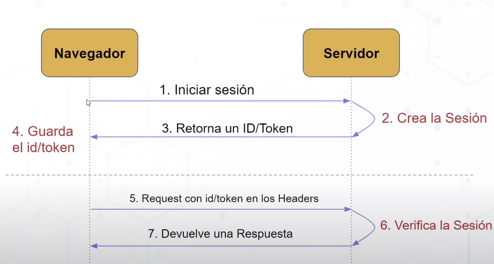

# Fullstack (springboot, hibernate, JWT, API Rest)

Curso sobre como crear un sistema de usuario completo en Java con springboot, hibernate, JWT y API Rest con arquitectura MVC. CRUD con usarios y su inicio de sesión por hashes y tokens.

## Base

Proyecto basado en: 'https://www.youtube.com/watch?v=7vHzVN0EiQc&ab_channel=ATLAcademy%28byLucasMoy%29' \
Init: 'https://start.spring.io/' \
Front: Simple con HTML, JS, Booststrp: 'https://startbootstrap.com/theme/sb-admin-2'

## Contenido de aprenfizaje

1. Inyección de dependencias
2. Control de sesion de usuarios con estandar JWT
3. Servicios API-REST con SpringBoot 3.0.5 (springweb)
4. ORM con Hibernate
5. Inicializar proyecto con: 'https://start.spring.io/'
6. Dependencias con MAVEN (3.9.1) y Empaquetado WAR - openJDK 17.0.6
7. Front: Plantilla de Booststrap con HTML puro y js basico
8. Mysql
9. Sesiones con JWT

## Estrutura de archivos

1. POM.xml: Estructura del proyecto, definiciones y dependencias de maven
2. src: codigo
3. test: codigo para pruebas
4. main: codigo del proyecto
5. resources: archivos de configuración y archivos del front
6. resources/static: archivos de acceso publico: archivos multimedia, *.html o index.html
7. java: codigo fuente del proyecto

## Comandos Spring boot

- iniciar app web: `mvn spring-boot:run`
- limpiar proyecto para recompilar: `mvn:clean`

Aplicación: Apache Tomcat: puerto 8080

# XML vs JSON

Manera de como se hace el intercambia de información entre servicios.

| XML                                                    	| vs 	| JSON                                                    	|
|--------------------------------------------------------	|----	|---------------------------------------------------------	|
| XML: Lenguaje de marcado extensible                    	|    	| JSON: JavaScript Object Notation                        	|
| uso de Tags personalizados si se quiere                	|    	| Es mas lijero                                           	|
| Es un estandar                                         	|    	| Es un formato                                           	|
| Estructura rigida                                      	|    	| Estrutura menos rigida                                  	|
| Objetos como con elementos anidados uno dentro de otro 	|    	| Objetos anidados entre [, ] y la información entre {, } 	|
|                                                        	|    	| Mayor compatibilidad con tecnologias web                	|
|                                                        	|    	| Solo soporta datos: texto, numero, nulo y booleano      	|

# Estrutura LINK Simple

URI: Identificador Uniforme de Recurso -> 'https://mydominio.com/ruta-path/inicio-sitio.html#posts'
URL: Localizador Uniforme de Recurso -> 'https://mydominio.com/ruta-path/inicio-sitio.html'
URN: Nombre Uniforme de Recurso -> 'mydominio.com/ruta-path/inicio-sitio.html#posts'
Esquema: https
Dominio: mydominio.com
Ruta: ruta-path
Locación: inicio-sitio.html
Recurso: posts

# Estrutura LINK

Authority: Información de autenticación con usuario, contraseña y @dominio
Host: dominio del sitio
Puerto: puerto de comunicación con el servidor
Query: Usando ? se envian parametros y su información, se separa parametros con coma

# Metodos HTTP

- GET: Consultar, Se envia la información en la url
- POST: Crear, ej: crear una nueva entidad
- PUT: Modificar, ej: modificar todos los datos de una entidad
- PATCH: Modificar, ej: modificar algunos datos de una entidad
- DELETE: Eliminar, ej: eliminar una entidad 

# Arquitectura MVC

Patron de arquitectura Modelo, Vista y Controlador. Peticion por URL que retorna html.

- M: Se encarga de realizar las operaciones de los datos en la BD y le devuelve informarción al Controlador
- V: Se encarga de generar el html que envia al cliente para ser mostrado, toma la información del Controlador
- C: Se encarga de la gestion/logica cuando el usuario usa la url:'myappweb/usuario', la interacción con la BD se delega al Modelo
  - Los controladores vevuelven los recursos para trabajar en el front, ej: lista, datos

## Controlador en java

- Indica que es controller: `@RestController`
- Indicar que el metodo que responde al resquest del front segun la url indicada: `@RequestMapping(value = "api/usuarios/{otro-valor}", method = RequestMethod.GET)` Se usa get para indicar que es metodo de consulta
- Para recibir datos por url get, indicar que el parametro del metodo (otro-dato) se usa como parametro de la url que llega: `@PathVariable otro-dato`
- Para recibir una entidad por post, indicar que el parametro del metodo se contruye y convierte en una entidad, se usa `@RequestBody Empleado emp`
- La consultas a la BD se hacen a travez de la variable *EmpleadoDAO empleadoDAO*, estos metodos son los que define la interfaz *DAO*
- La variable *EmpleadoDAO empleadoDAO* tiene la notación `@Autowired` para indicar que el objeto se instancia automaticamente y se comparte en memoria para ser usado por cualuier clase-

## Controlador/Base da datos *DAO*

- La clase *DAO* define los metodos que van a implementar las clases comunes entre todas los modelos
- La clase *DAO implement* implementa la interfaz *DAO* esto se hace para cada Modelo
- Notación en el *DAO implement* para indicar que la clase se usa para tratar con la BD
- En *DAO implement* se indica que la clase trata con la BD con `@Repository` y `@Transactional`
- Se crea la variable de tipo de la interfaz *EntityManager entityMan* para usar como dependencia inyectada para tratar los asuntos con las BD a travez de esta
- A la variable *EntityManager entityMan* se le indica su funciona de tratar con la BD con `@PersistenceContext`
- Los metodos que deben tratar con la BD usan la variable *EntityManager entityMan* y se le indica al metodo que hacen uso de la BD con `@Transactional`

## Modelo en java

- Notación en la clase Model para indicar que propiedades son que columnas de la tabla: `@Entity` y `@Table(name = "templeados")` //se coloca el nombrde de la tabla de la BD
- Notación en la clase Model para indicar se usa una propiedad como ID con: `@Id`

## Otras en java

- En *Application.properties* se define el puerto de la aplicación web, por dejecto es *80*, aca es *5050*
- En *Application.properties* se define la conexión a la BD, en ningun otro lado mas se debe hacer algo

# Arquitectura REST

Patron de arquitectura REST. Peticion por AJAX o Fetch que retorna json. Es mucho mas dinamico. Ideal para aplicaciones web y movil.

- C (controller): Se encarga de redirigir por rutas segun la peticion del cliente y deriva al Servicio.
- S (service): Se encarga de realizar la logica con datos
- R (repository): Se encarga de realizar la logica de los datos en la BD, los datos de las entidades son delegados al Modelo
- M (model): Es donde esta definida la entidad que corresponda a la BD y las entidades son devueltas al Repositorio

# Uso de principio SOLID

1. Principio de responsabilidad única:Consiste en que una modulo/clase debe ser responsable solo de una parte de la funcionalidad del código. Con esto, si llega a existir una razón para cambiar algo, no será necesario reescribir todo.
2. Principio de abierto/cerrado: Hace referencia a que una modulo/clase debe tener la posibilidad de extenderse, pero no de modificarse.
3. Principio de sustitución de Liskov.Establece que cada subclase puede reemplazarse por la clase base sin que se altere el comportamiento del programa.
4. Principio de segregación de la interfaz: Una interfaz grande se puede dividir en partes pequeñas para que cada una se preocupe por el método que le interesa.
5. Principio de inversión de la dependencia: Mantener los modulos/capas desacoplados. Los módulos de alto nivel (logica de negocio) no deberían depender de los módulos de bajo nivel (ej: como se hace una implentación).
   1. En este proyecto se usa con el patron *inversion de control* con las clases DAOImpl que implentan la interfaz DAO de cada modelo, la inyección de dependecias ser hace con la variable *UsuarioDAO usuarioDAO* dentro del Controller

# BD

- XAMPP 8.2.2.0-0 -> Mysql:3306
- BD: EMPRESAABC, utf8_bin
  - tusuarios
    - id: INT
    - nombres: VARCHAR(100)
    - apellidos: VARCHAR(100)
    - telefono: BIGINT UNSIGNED
    - correo: VARCHAR(100)
    - passw: VARCHAR(255) (se almacena el hash)

# Flujo inicio de Sesión por Tokens

1. La acción inicia en el navegador al dar click
2. Se envia una solicitud al servidor
3. El servidor verifica y crea una sesión (**JWT**), luego retorna el token de la sesión
   1. La sesión se crea y se envia al navegador, esto permite escalar horizaontalmente al no tener que guardar los dato en el servidor
4. El navegador guarda el token
   1. Esta información se envia el los request dentro de la cabeza como información de autenticación
5. Por cada request que envia el navegador se envia el token al servidor
6. El servidor verifica la sesión con el token
7. El servidor procesa el request y devuelve la respuesta

